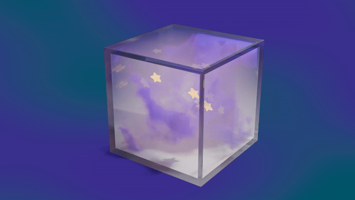

# 🔮 Violet Haze

Un cubo di vetro che ruota su se stesso, con dentro una nebbia volumetrica viola in continua evoluzione e stelle cartoon che fluttuano liberamente. Animazione in **loop perfetto** di 5 secondi, realizzata in Blender con Cycles.

<p align="center">
  
</p>

---

## ✨ Caratteristiche

- **Vetro realistico** con Glass BSDF + Transparent BSDF e trucco *Light Path → Is Shadow Ray* per ombre chiare e trasparenti
- **Nebbia volumetrica** con Principled Volume, Noise Texture 4D animata e Color Ramp per le zone dense/vuote
- **Stelle cartoon a 5 punte** modellate a mano, gonfie (Bevel + Subdivision Surface) e luminose (Emission con sfumatura giallo/arancio tramite Layer Weight)
- **Movimento libero delle stelle** dentro il cubo, interamente gestito da driver matematici
- **Rotazione del cubo** in loop perfetto (90° in 120 frame, sfruttando la simmetria del cubo)
- **Sfondo sfocato** viola/azzurro generato nel World con Noise Texture su coordinate *Window*
- **Pavimento invisibile** con Shadow Catcher: si vede solo l'ombra del cubo

---

## 🛠️ Specifiche tecniche

| Voce | Valore |
|---|---|
| Software | Blender 5.2 LTS |
| Motore di render | Cycles (GPU) |
| Durata | 5 secondi (120 frame @ 24 fps) |
| Tempo di render | ~18 s a frame (da ~16 min prima dell'ottimizzazione) |
| Output | Sequenza PNG → MP4 (H.264) → GIF per il README |

### Ottimizzazione del render
Il primo test richiedeva circa **16 minuti a frame** (~32 ore totali). Con queste impostazioni si è scesi a **~18 secondi**:

- Render su **GPU** invece che CPU
- **Volumes**: Step Rate Render 2-3, Max Steps 256
- **Sampling**: Noise Threshold 0.05, Max Samples 128, Denoise attivo
- **Light Paths** ridotti (Volume bounces 1, Transmission/Transparent 8)
- **Persistent Data** attivo

---

## 🧮 Driver utilizzati

Tutta l'animazione è basata su driver, senza keyframe: il loop è garantito matematicamente.

| Oggetto | Proprietà | Espressione | Effetto |
|---|---|---|---|
| Glass box | Rotation Z | `#radians(frame*0.75)` | 90° in 120 frame |
| Cloud (Noise Texture) | W | `#frame/60` | La nebbia cambia forma |
| Star | Location X | `#sin(frame*pi/60 + 0)*0.5` | Fluttuazione orizzontale |
| Star | Location Y | `#sin(frame*pi/30 + 2)*0.5` | Fluttuazione in profondità |
| Star | Location Z | `#cos(frame*pi/60 + 4)*0.4` | Fluttuazione verticale |
| Star | Rotation Z | `#radians(frame*3)` | Un giro completo su se stessa |

Ogni stella usa le stesse formule con **fasi diverse** (il numero sommato dentro `sin`/`cos`), così si muovono in modo indipendente.

> 💡 Nei driver Blender lavora in **radianti**: per questo si usa `radians()` per le rotazioni.

---

## 🗂️ Struttura della scena

```
Collection
├── Camera
├── Glass box          ← ruota tramite driver
│   ├── Cube           ← shell di vetro
│   ├── Cloud          ← nebbia volumetrica
│   └── Star (x N)     ← stelle cartoon con driver di movimento
├── Light
└── Plane              ← Shadow Catcher
```

---

## 📁 Struttura della cartella

```
Violet Haze/
├── Violet-Haze.blend
├── README.md
└── Renders/
    ├── preview.gif
    └── Violet-Haze.mp4
```

---

## 🎓 Cosa ho imparato

- In **Material Preview** Blender usa un HDRI di default e ignora il World: per valutare vetro e Light Path serve la modalità **Rendered** in Cycles
- I **driver** (`#frame`, `sin`, `cos`, `radians`) sono il modo più semplice per ottenere animazioni in loop perfetto
- Con la **parentela** (`Ctrl+P`) nebbia e stelle seguono la rotazione del cubo; *Without Inverse* fa coincidere lo 0,0,0 con il centro del genitore
- Nei Geometry Nodes il nodo **Set Material** mostra solo materiali già esistenti
- I **volumi** sono la parte più pesante del render: Step Rate e Max Steps fanno la differenza più grande

---

## 🚀 Prossimi passi

- [ ] Nodo **Glare** (Fog Glow) nel Compositing per far brillare stelle e nebbia
- [ ] Pavimento **riflettente** al posto dello Shadow Catcher
- [ ] Sfondo con **gradiente verticale** azzurro → blu scuro
- [ ] Contorno nero stile fumetto sulle stelle
- [ ] Versione da 10 secondi per i social

---

## 🙏 Crediti

Progetto ispirato a un tutorial pubblicato su Instagram, rielaborato con animazione tramite driver, stelle a movimento libero e ottimizzazione del render.
